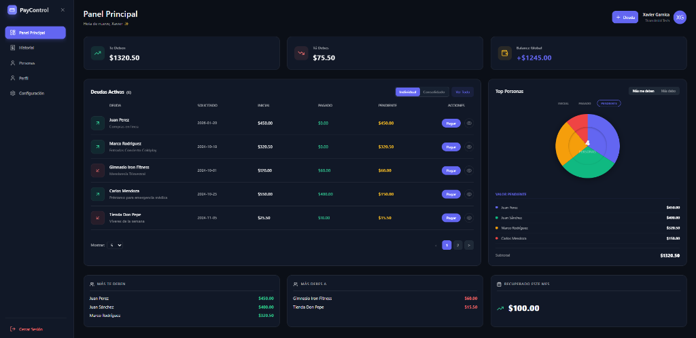

# PayControl - Gestión Financiera Personal

[](https://reactjs.org/)
[](https://supabase.com/)
[](https://opensource.org/licenses/MIT)

**PayControl** es una plataforma de gestión financiera personal diseñada para llevar un control riguroso de deudas prestadas y pedidas. Con una interfaz de alto impacto y un motor robusto en la nube, PayControl transforma la forma en que manejas tus compromisos económicos.



## ✨ Funcionalidades

*   **📊 Dashboard Inteligente**: Visualiza tu balance global, deudas activas y estadísticas avanzadas en una sola pantalla.
*   **🔄 Arquitectura Híbrida**: Cambia instantáneamente entre **Modo Local (Mock)** para pruebas rápidas y **Modo Cloud (Supabase)** para persistencia real.
*   **👥 Gestión de Contactos**: Directorio unificado de personas con historial de transacciones individual y consolidado.
*   **📱 Experiencia Multi-dispositivo**: Diseño responsivo optimizado para una gestión ágil desde el móvil o el escritorio.
*   **📑 Historial y Evidencias**: Seguimiento detallado de cada abono con notas y estados automatizados (Activo, Pagado, Archivado).
*   **🔒 Seguridad de Grado Bancario**: Autenticación segura y políticas de protección de datos (RLS) integradas con Supabase.

---

## 🛠️ Guía de Inicio Rápido

### 1. Requisitos Previos

- **Node.js** (v18 o superior)
- **NPM** o **Yarn**

### 2. Instalación

Clona el repositorio y prepara el entorno:

```bash
git clone https://github.com/fxaviergb/web-paycontrol.git
cd app-paycontrol
npm install
```

### 3. Configuración de Variables de Entorno

Crea un archivo `.env` en la raíz del proyecto. Copia y pega lo siguiente, ajustando según tus necesidades:

```env
# URL de API y Llave Anónima de tu proyecto Supabase
VITE_SUPABASE_URL=https://tu-proyecto.supabase.co
VITE_SUPABASE_ANON_KEY=tu-anon-key-aqui

# Proveedor de Datos: 'mock' o 'supabase'
VITE_DATA_PROVIDER=supabase
```

### 4. Lanzamiento

Inicia el servidor de desarrollo:

```bash
npm run dev
```

La aplicación estará disponible en `http://localhost:5173`.

---

## 🏗️ Configuración del Backend (Supabase)

Para habilitar todas las funciones de persistencia y autenticación, sigue estos pasos:

1.  **Crea un Proyecto** en [Supabase Dashboard](https://app.supabase.com).
2.  **Configura la Autenticación**: Habilita el proveedor de Correo/Contraseña.
3.  **Ejecuta el Esquema**: Ve al **SQL Editor** de Supabase y crea las tablas necesarias (`profiles`, `persons`, `debts`, `payments`).
4.  **Configura las RLS**: Asegúrate de habilitar Row Level Security para que cada usuario solo vea sus propios datos.

---

## 📂 Estructura del Código

```bash
src/
├── components/     # UI modular (Modales, Dashboard, Auth)
├── contexts/       # Gestión de estado global (AuthContext)
├── services/       # Lógica de API (SupabaseService vs MockService)
├── data/           # Datos estáticos y Mock
├── App.jsx         # Orquestador principal
└── index.css       # Sistema de diseño y tokens de estilo
```

---

## 🦾 Contribución

¿Quieres mejorar PayControl? ¡Los pull requests son bienvenidos! Para cambios mayores, abre un issue primero para discutir lo que te gustaría cambiar.

---

Desarrollado con 🔥 por **xavogb08**
